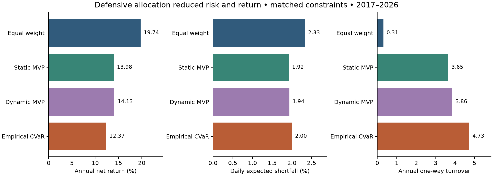
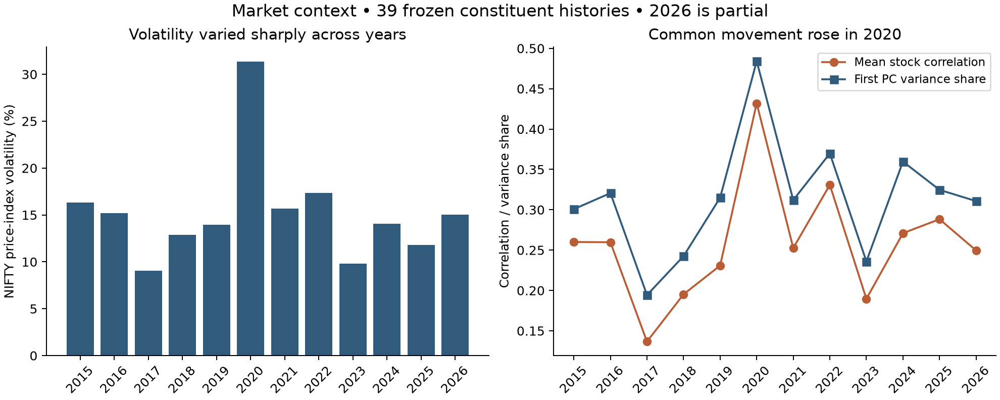
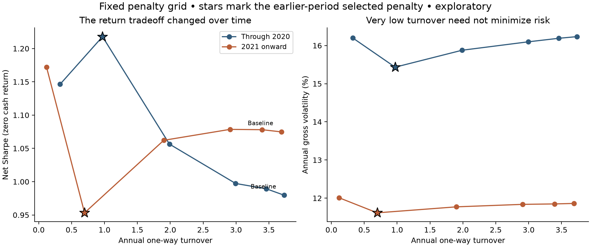

# Portfolio Optimization Trade-off Analysis

An empirical study of how minimum-variance and tail-risk portfolio objectives
translate into realized risk, return, concentration, and trading costs.

The project evaluates time-varying minimum-variance portfolio (TV-MVP) methods
on a frozen universe of 39 long-history Indian equities. Rather than selecting
a single "best" optimizer, it asks a more practical question: **what does each
method improve, and what does it give up in exchange?** All headline comparisons
use the same long-only constraints, rebalance schedule, transaction-cost model,
and out-of-sample dates.

## Research questions

- Does minimum-variance optimization provide meaningful protection during
  high-volatility and falling-market periods?
- Do time-varying covariance estimates materially change portfolio decisions
  relative to a simpler covariance estimate?
- Does directly optimizing empirical CVaR improve realized tail risk?
- How much concentration and turnover accompany the observed risk reduction?
- Does penalizing turnover improve net performance consistently across periods?

## Data and experimental design

| Component | Specification |
|---|---|
| Asset universe | 39 equities with sufficiently long price histories, selected from a later NIFTY 50 membership list |
| Market context | NIFTY price index |
| Out-of-sample period | 1 February 2017 to 31 August 2026 |
| Out-of-sample observations | 2,362 trading days |
| Estimation window | 504 trading days |
| Rebalancing | Monthly; new weights applied from the next trading day |
| Portfolio constraints | Fully invested, long only, maximum 10% per stock |
| Trading cost | 10 bps per unit of absolute traded notional |
| Risk measures | Annualized volatility, daily 95% expected shortfall and maximum drawdown |

The comparison covers equal weighting, a static-covariance MVP, a
dynamic-factor MVP, empirical CVaR, and turnover-regularized MVP variants.
Returns and risk metrics are reconstructed from the retained daily strategy
paths so that accounting conventions remain consistent across models.

## Main results

### Full-sample matched comparison

| Strategy | Net CAGR | Gross volatility | Daily ES95 | Net Sharpe | Annual turnover |
|---|---:|---:|---:|---:|---:|
| Equal weight | **19.74%** | 15.94% | 2.33% | **1.21** | 0.31 |
| Static covariance MVP | 13.98% | **13.81%** | **1.92%** | 1.02 | 3.65 |
| Dynamic-factor MVP | 14.13% | 13.89% | 1.94% | 1.02 | 3.86 |
| Empirical CVaR | 12.37% | 14.19% | 2.00% | 0.89 | 4.73 |

These results show a genuine defensive effect, but not a free improvement.
Relative to equal weight, the static MVP reduced annualized volatility by
**2.13 percentage points** and daily ES95 by **0.41 percentage points**, while
surrendering **5.76 percentage points** of annual net return. Its realized
volatility was lower in every observed calendar year, but equal weight earned a
higher net return in nine of the ten calendar periods (2026 is partial).



### Findings

1. **Diversification weakened during market stress.** Mean pairwise stock
   correlation increased from **0.137 in 2017** to **0.432 in 2020**, while
   annualized NIFTY volatility increased from **9.0% to 31.3%**. On days
   classified in advance as high volatility, mean correlation was **0.397**,
   compared with **0.211** on other days.

2. **The MVP behaved like a defensive portfolio.** Its estimated beta to the
   equal-weight portfolio was approximately **0.77**. On the worst 5% of NIFTY
   days, the static MVP lost **1.67% per day on average**, compared with
   **2.23%** for equal weight. On all NIFTY up days, however, it gained only
   **0.53% per day**, compared with **0.68%** for equal weight.

3. **Additional covariance complexity barely changed the outcome.** Static and
   dynamic MVP daily returns had **0.996 correlation** and only **1.27% annualized
   tracking error**. Their realized volatility and tail loss were nearly
   identical, while the dynamic model traded slightly more.

4. **A stock cap did not guarantee broad diversification.** Although every
   holding was capped at 10%, the static MVP averaged approximately **14.2
   effective positions**, **20 non-zero holdings**, and **46.5% in its five
   largest positions**. Equal weight maintained 39 effective positions.

5. **The return gap was economically attributable.** Bajaj Finance, BEL, and
   Adani Ports together explained approximately **2.47 percentage points** of
   the **4.59-point annual arithmetic gross-return gap** between equal weight
   and the static MVP. The optimizer allocated little to these stocks because
   it targeted risk rather than future returns.

6. **Lower turnover was useful, but not consistently valuable.** A fixed
   turnover penalty reduced annual one-way turnover from roughly **3.7 to 0.7**
   after 2020. Over that period it gave up **2.27 percentage points** of annual
   gross return while saving **0.60 points** in costs at 10 bps. Its estimated
   net-Sharpe break-even cost was about **34 bps**, illustrating that turnover
   reduction alone is not an investment result.





## Interpretation

The evidence supports a clear risk-return trade-off: risk-minimizing portfolios
provided observable downside protection, but their low-beta exposure,
concentration, and exclusion of high-return stocks reduced upside participation.
More elaborate risk estimators did not automatically create meaningfully
different portfolios under realistic constraints.

The project also audits negative findings. A previously explored downside-factor
construction was rejected because its result changed when arbitrary PCA factor
signs were reversed, even though the reconstructed asset returns were identical.
That method is therefore excluded from the substantive conclusions.

The complete methodology, robustness checks, result interpretation, and
implementation audit are documented in the
**[full analytical report](ANALYTICAL_STUDY.md)**.

## Repository structure

```text
.
├── data/
│   ├── raw/                    # Frozen equity and index prices
│   └── data_manifest.json
├── results/
│   ├── tables/                 # Retained daily returns, turnover and weights
│   └── analysis/               # Generated tables, figures and hash manifest
├── scripts/
│   └── run_analytical_study.py # Reproduces the analytical synthesis
├── src/tvmvp_ext/              # Portfolio and analysis implementation
├── tests/                      # Analytical consistency tests
├── config.yaml                 # Estimation and evaluation settings
└── ANALYTICAL_STUDY.md         # Full report
```

## Reproducing the analysis

Python 3.10 or later is recommended.

```bash
git clone https://github.com/AdithyaaCh/Portfolio-Optimization-Tradeoff-Analysis.git
cd Portfolio-Optimization-Tradeoff-Analysis

python3 -m venv .venv
source .venv/bin/activate
python -m pip install --upgrade pip
python -m pip install -e .

python scripts/run_analytical_study.py
```

The script validates the retained return, weight, turnover, cost, and attribution
identities before writing **16 tables, three figures, and a SHA-256 input
manifest** to `results/analysis/`. It uses only the frozen local inputs: it does
not download current market data or search for alternative strategy parameters.

To run the consistency tests:

```bash
python -m pip install pytest
pytest -q
```

## Limitations

- The stock universe is based on later NIFTY constituents with long histories,
  creating survivorship and membership bias.
- The equal-weight portfolio is a 39-stock research benchmark, not the NIFTY 50
  index portfolio.
- Regime and return-attribution results describe this realized sample and are
  not trading signals.
- Monthly tail estimates are noisy, and all net results depend on the assumed
  10-bp linear transaction cost.
- The analysis is exploratory and does not claim future profitability.

This repository is intended as a reproducible empirical portfolio-analysis
project, not as investment advice.
